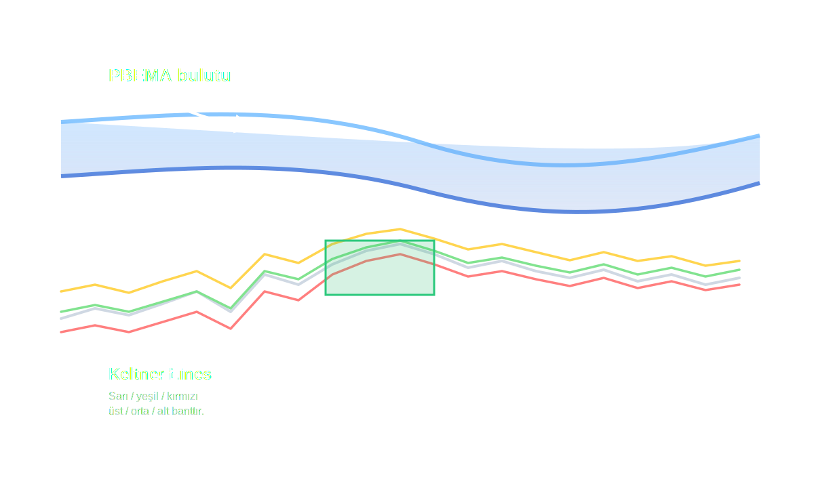

# PBEMA bulutu örnek işaretleme

Aşağıdaki diyagram, paylaştığınız rapordaki görünümü temel alarak hangi katmanın PBEMA bulutu, hangilerinin Keltner Lines olduğunu netleştirir:

- **PBEMA bulutu:** Grafiğin üst kısmında yer alan kalın mavi gölgeli bandır; PBEMA üst/alt eğrileriyle sınırlanır.
- **Keltner Lines:** Fiyatın etrafında yakın seyreden sarı, yeşil ve kırmızı hatlardır (üst, orta, alt bant).

> Mavi gölgeli alan PBEMA bulutunu, renkli üçlü hat ise Keltner Lines'ı temsil eder; canlı işlem ve backtest raporları artık aynı renk paleti ve katman tanımlarıyla hizalanır.
